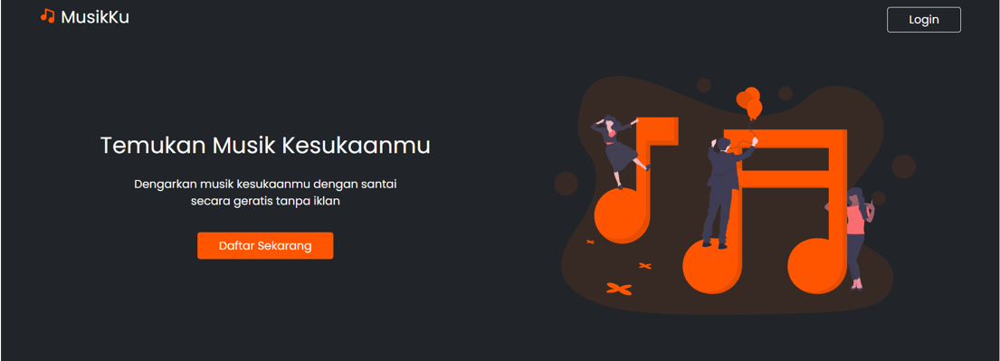
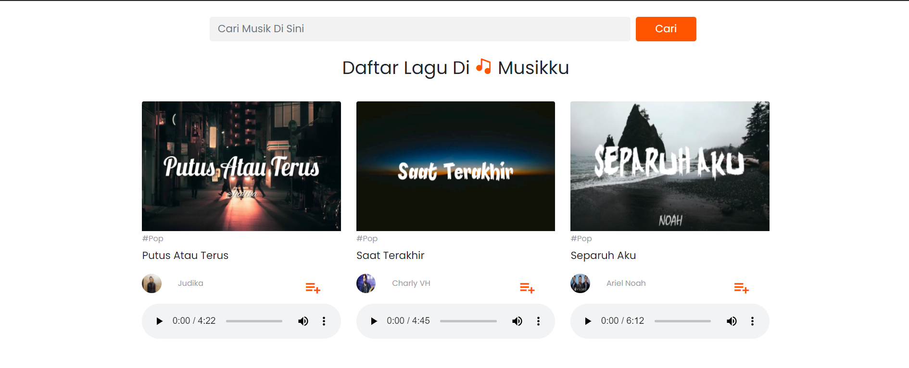

# Aplikasi-MusikKu

Hai teman - teman salam kenal saya Aris Munandar. Baik disini saya akan sedikit share tentang project yang saya buat yaitu aplikasi MusikKu. Nah sebelumnya apa itu aplikasi MusikKu ? jadi aplikasi MusikKu adalah sebuah web aplikasi yang menyediakan layanan untuk mendengarkan lagu secara geratis. Aplikasi MusikKu sendiri dibangun menggunakan Node Js, Express Js, Bootstrap 5, Boxicons dan Sweetalert2.

Langkah - langkah menginstall aplikasi :
1. Pastikan teman - teman telah memiliki XAMPP jika sudah punya silahkan jalankan XAMPP untuk Apache dan Mysql nya
2. Selanjutnya masuk ke phpmyadmin dan buat database baru dengan nama tb_music
3. Jika sudah silahkan teman - teman import file db_music.sql di tb_music
4. Jika berhasil import makan akan ada beberapa tabel dan di sebagian tabel sudah memiliki data dan itu biarkan saja :)
5. Oke selanjutnya jika proses di atas berhasil maka selanjutnya yang harus di install laptop teman - teman yaitu Node Js
6. Jika sudah memiliki Node Js silahkan masuk ke folder dari aplikasi MusikKu yang telah di install teman - teman melalui terminal
7. Kemudian jalankan perintah npm i selanjutnya npm start
8. Selanjutnya buka browser dan buka http://localhost:8000
9. Selamat !!! aplikasi sudah siap di gunakan ( login sebagai admin => email(admin@gmail.com), password(admin) )

Untuk Tampilan Aplikasi Sebagai Berikut

